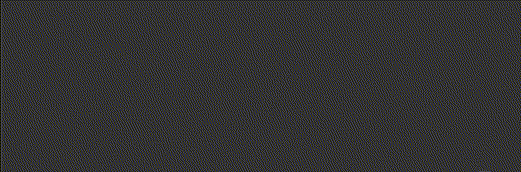
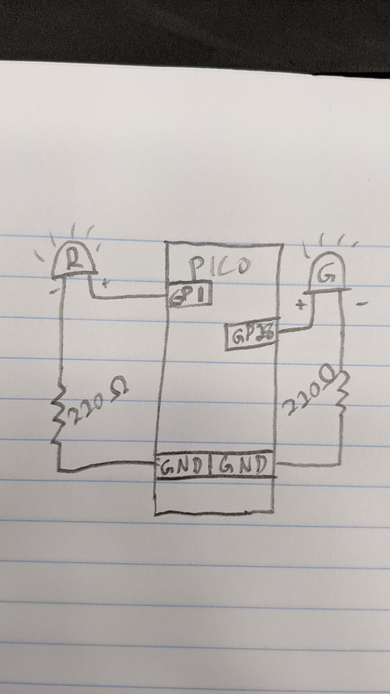
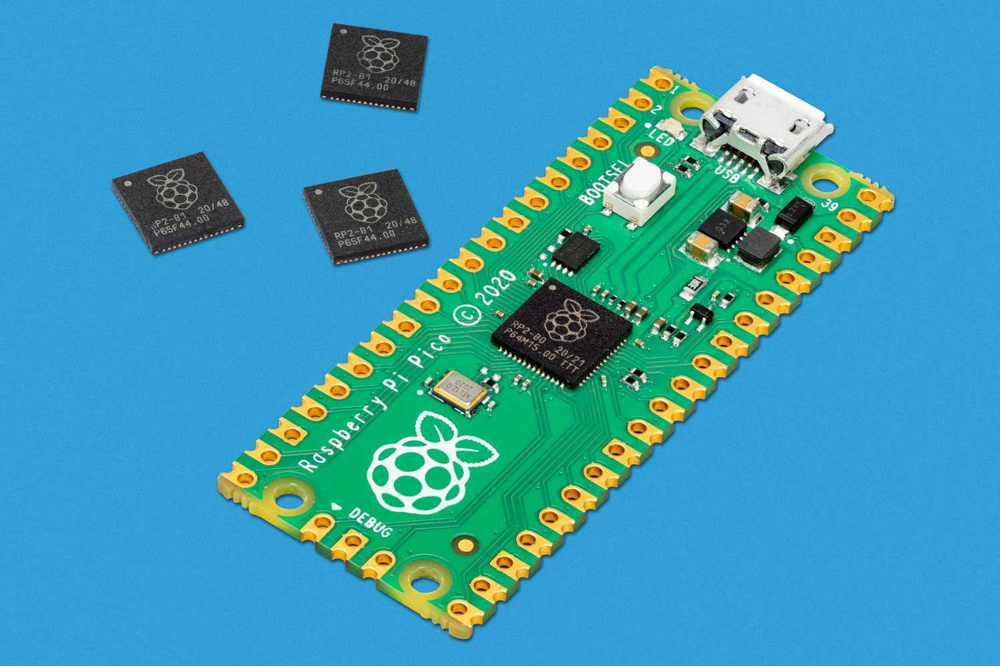

# Engineering_4_Notebook

&nbsp;

## Table of Contents
* [Launch_Pad_Part_1](#Launch_Pad_Part_1)
* [Launch_Pad_Part_2](#Launch_Pad_Part_2)
* [Raspberry_Pi_Assignment_Template](#Raspberry_Pi_Assignment_Template)
* [Onshape_Assignment_Template](#Onshape_Assignment_Template)

&nbsp;

## Launch_Pad_Part_1

### Assignment Description

The assignment for the Launch Pad series is to create a simulated launch pad. The first part is a script that counts down from 10 seconds to liftoff.

### Evidence 

There was no wiring necessary for this assignment.

### Code
[countdown.py](raspberry-pi/countdown.py)

### Reflection

A while true loop did not work for this assignment, and I had to look up how to use a for loop with a range function. Also, the range didn't work going from 10 to 1 so I had to add a function that subtracts the value x from 10.

&nbsp;

## Launch_Pad_Part_2

### Assignment Description

The assignment for the Launch Pad series is to create a simulated launch pad. The second part is a script that counts down from 10 seconds to liftoff. It must blink a red LED each second and a green LED at liftoff.

### Evidence 

### Code
[countdownBlink.py](raspberry-pi/countdownBlink.py)

### Reflection

This assignment was pretty straightforward. The tricky part was that when I ran it, the green LED shut off by itself rather than staying on. I then figured out that I could add a while True loop after the for loop so that the green LED would stay on.

&nbsp;

## Launch_Pad_Part_3

### Assignment Description

The assignment for the Launch Pad series is to create a simulated launch pad. The third part is a script that counts down from 10 seconds to liftoff after pressing a button. It must blink a red LED each second and a green LED at liftoff.

### Evidence 

### Code
[countdownButton.py](raspberry-pi/countdownButton.py)

### Reflection

To complete this assignment, I had to relearn how a button works. Also, I was unfamiliar with the digitalio Pull down command, which I had to use to identify a pin as a pulldown resistor. This allowed the board to see when it was getting a 3.3V signal without an external resistor and without catching on fire.

&nbsp;

## Raspberry_Pi_Assignment_Template

### Assignment Description

Write your assignment description here. What is the purpose of this assignment? It should be at least a few sentences.

### Evidence 

Pictures / Gifs of your work should go here. You need to communicate what your thing does. 

### Wiring

This may not be applicable to all assignments. Anything where you wire something up, include the wiring diagram here. The diagram should be clear enough that I can recreate the wiring from scratch. 

### Code
Give me a link to your code. [Something like this](https://github.com/millerm22/Engineering_4_Notebook/blob/main/Raspberry_Pi/hello_world.py). Don't make me hunt through your folders, give me a nice link to click to take me there! Remember to **COMMENT YOUR CODE** if you want full credit. 

### Reflection

What went wrong / was challenging, how'd you figure it out, and what did you learn from that experience? Your goal for the reflection is to pass on knowledge that will make this assignment better or easier for the next person. Think about your audience for this one, which may be "future you" (when you realize you need some of this code in three months), me, or your college admission committee!

&nbsp;

## Onshape_Assignment_Template

### Assignment Description

Write your assignment description here. What is the purpose of this assignment? It should be at least a few sentences.

### Part Link 

[Create a link to your Onshape document](https://cvilleschools.onshape.com/documents/003e413cee57f7ccccaa15c2/w/ea71050bb283bf3bf088c96c/e/c85ae532263d3b551e1795d0?renderMode=0&uiState=62d9b9d7883c4f335ec42021). Don't forget to turn on link sharing in your Onshape document so that others can see it. 

### Part Image

Take a nice screenshot of your Onshape document. 

### Reflection

What went wrong / was challenging, how'd you figure it out, and what did you learn from that experience? Your goal for the reflection is to pass on knowledge that will make this assignment better or easier for the next person. Think about your audience for this one, which may be "future you" (when you realize you need some of this code in three months), me, or your college admission committee!

&nbsp;

## Media Test

Your readme will have various images and gifs on it. Upload a test image and test gif to make sure you've got the process figured out. Pick whatever image and gif you want!

### Test Link

[Google](http://www.google.com)
[Temp.py](raspberry-pi/temp.py)

### Test Image

### Test GIF

