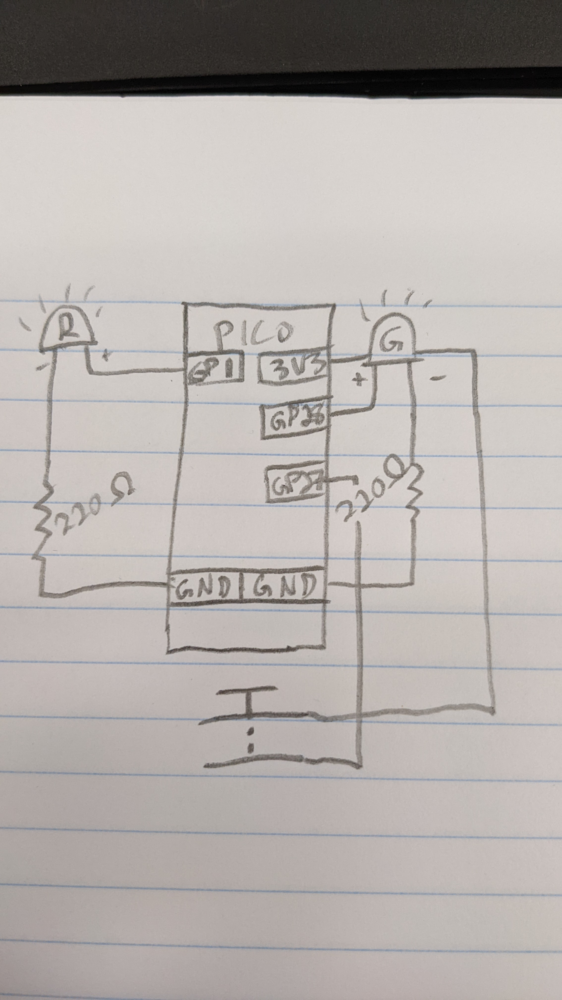
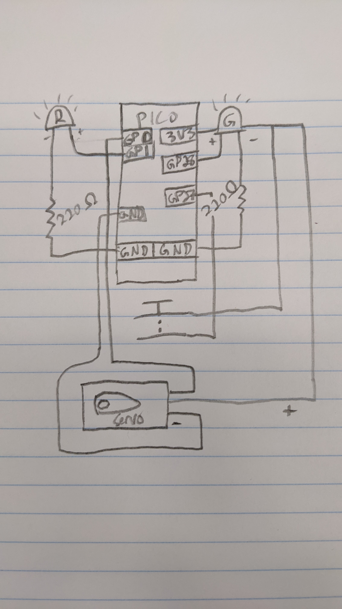
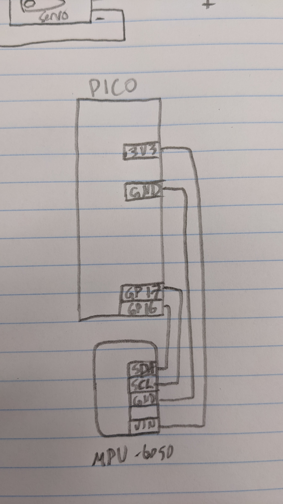
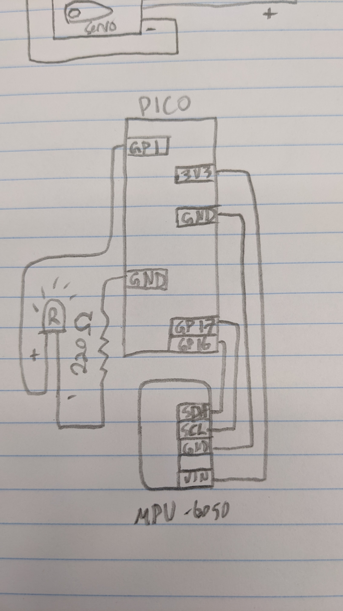
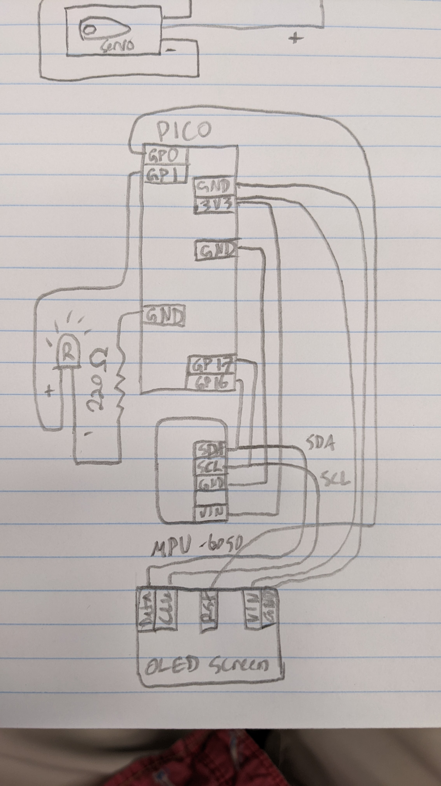
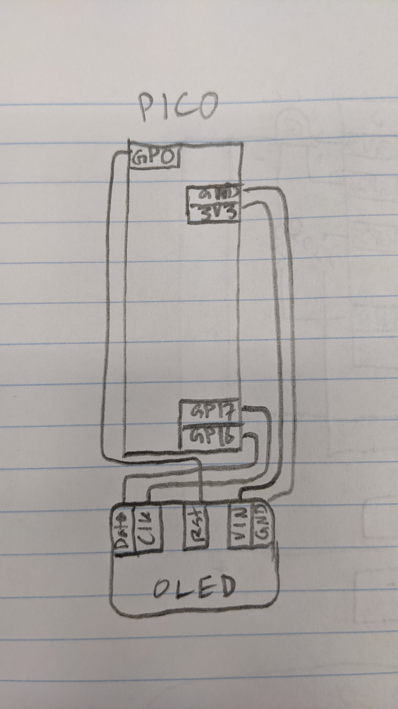
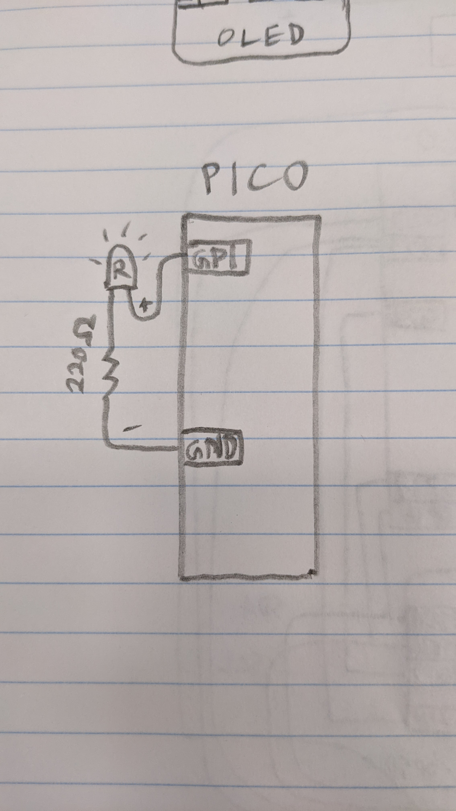

# Engineering_4_Notebook

&nbsp;

## Table of Contents
* [Launch_Pad_Part_1](#Launch_Pad_Part_1)
* [Launch_Pad_Part_2](#Launch_Pad_Part_2)
* [Launch_Pad_Part_3](#Launch_Pad_Part_3)
* [Launch_Pad_Part_4](#Launch_Pad_Part_4)
* [Crash_Avoidance_Part_1](#Crash_Avoidance_Part_1)
* [Crash_Avoidance_Part_2](#Crash_Avoidance_Part_2)
* [Crash_Avoidance_Part_3](#Crash_Avoidance_Part_3)
* [Landing_Area_Part_1](#Landing_Area_Part_1)
* [Landing_Area_Part_2](#Landing_Area_Part_2)
* [Landing_Area_Part_3](#Landing_Area_Part_3)
* [Morse_Code_Part_1](#Morse_Code_Part_1)
* [Morse_Code_Part_2](#Morse_Code_Part_2)
* [Raspberry_Pi_Assignment_Template](#Raspberry_Pi_Assignment_Template)
* [Onshape_Assignment_Template](#Onshape_Assignment_Template)

&nbsp;

## Launch_Pad_Part_1

### Assignment Description

The assignment for the Launch Pad series is to create a simulated launch pad. The first part is a script that counts down from 10 seconds to liftoff.

### Evidence 

There was no wiring necessary for this assignment.

### Code
[countdown.py](raspberry-pi/countdown.py)

### Reflection

A while true loop did not work for this assignment, and I had to look up how to use a for loop with a range function. Also, the range didn't work going from 10 to 1 so I had to add a function that subtracts the value x from 10.

&nbsp;

## Launch_Pad_Part_2

### Assignment Description

The assignment for the Launch Pad series is to create a simulated launch pad. The second part is a script that counts down from 10 seconds to liftoff. It must blink a red LED each second and a green LED at liftoff.

### Evidence 

### Code
[countdownBlink.py](raspberry-pi/countdownBlink.py)

### Reflection

This assignment was pretty straightforward. The tricky part was that when I ran it, the green LED shut off by itself rather than staying on. I then figured out that I could add a while True loop after the for loop so that the green LED would stay on.

&nbsp;

## Launch_Pad_Part_3

### Assignment Description

The assignment for the Launch Pad series is to create a simulated launch pad. The third part is a script that counts down from 10 seconds to liftoff after pressing a button. It must blink a red LED each second and a green LED at liftoff.

### Evidence 

### Code
[countdownButton.py](raspberry-pi/countdownButton.py)

### Reflection

To complete this assignment, I had to relearn how a button works. Also, I was unfamiliar with the digitalio Pull down command, which I had to use to identify a pin as a pulldown resistor. This allowed the board to see when it was getting a 3.3V signal without an external resistor and without catching on fire.

&nbsp;

## Launch_Pad_Part_4

### Assignment Description

The assignment for the Launch Pad series is to create a simulated launch pad. The fourth part is a script that counts down from 10 seconds to liftoff after pressing a button. It must blink a red LED each second and turn on a green LED and a servo at liftoff.

### Evidence 

### Code
[countdownServo.py](raspberry-pi/countdownServo.py)

### Reflection

This assignment was very straightforward. The code is exactly the same as Part 3, except I added in a servo object and a command at the very end. I also had to add the servo library from Adafruit.

&nbsp;

## Crash_Avoidance_Part_1

### Assignment Description

The premise for the Crash Avoidance series is to engineer a crash avoidance system for a scout helicopter on Mars. For part 1, I had to wire and code an MPU-6050 accelerometer and gyro using I2C. The Pico has to print the acceleration values in each direction every second.

### Evidence 

### Code
[accelerometer.py](raspberry-pi/accelerometer.py)

### Reflection

This was the first time I have used I2C. It doesn't seem very confusing, but it did take a few minutes to learn how it works. Also, I had to learn how to print using f-strings so I could print strings with embedded variables.

&nbsp;

## Crash_Avoidance_Part_2

### Assignment Description

For part 2 of Crash Avoidance, I had to use the accelerometer to determine if the board was tilted at 90 degrees by sensing acceleration due to gravity. When the board tilts 90 degrees, an LED must turn on. Also, I had to connect the Pico to a portable battery.

### Evidence 

### Code
[accelerometerLight.py](raspberry-pi/accelerometerLight.py)

### Reflection

This assignment was pretty straightforward because I learned how to use the accelerometer in the last assignment. I just had to create a couple if statements based on acceleration rather than printing it. The annoying part is that the accelerometer doesn't detect gravity as exactly 9.8 m/s^2, so the LED doesn't always stay on.

&nbsp;

## Crash_Avoidance_Part_3

### Assignment Description

For part 3 of Crash Avoidance, I had to connect an OLED screen to my Rpi Pico to continuously display angular velocity values. The values had to be rounded to three decimal places.

### Evidence 

### Code
[accelerometerOled.py](raspberry-pi/accelerometerOled.py)

### Reflection

This was the most complex assignment so far. I had to wire in the OLED screen to the same i2c bus as the MPU accelerometer, meaning I first had to run code to find the i2c addresses for both devices. I had to add a few new libraries for the OLED screen, and learn how to use new commands to display anything on it. Once I figured out how to display values on the screen, I had to round them, which was pretty easy.

&nbsp;

## Landing_Area_Part_1

### Assignment Description

For part 1 of Landing Area, I had to create a script for the Rpi Pico that takes a user input for three vertices and outputs the area of the triangle they form. It must also restart the script if one point is entered incorrectly.

### Evidence 

Wiring wasn't necessary for this assignment.

### Code
[landingArea1.py](raspberry-pi/landingArea1.py)

### Reflection

This assignment wasn't too difficult after I learned how to call on part of a split input using brackets. I had to look up the formula for area of a triangle using three vertices to put in my area function. After I wrote the code for the inputs, splits, and conversion to floats, I just put it inside of a while True loop with a try/except. If there is an error due to an incorrect input, the code will reset itself.

&nbsp;

## Landing_Area_Part_2

### Assignment Description

For part 2 of Landing Area, I had to write a script that includes Part 1, but also draws the triangle over coordinate axes on an OLED screen.

### Evidence 

### Code
[landingArea2.py](raspberry-pi/landingArea2.py)

### Reflection

This assignment wasn't that confusing, as I already had my OLED screen wired and I already learned how to code it in Crash Avoidance 3. I had an issue with the triangle coordinates at first, which was impossible to trace until I commented out the try/except loop. Since the origin on the OLED screen is in the top left, I couldn't just use the x,y coordinates as they were input. I had to add 64 to each x value and subtract each y value from 32 to end up with the triangle drawn in the right place.

&nbsp;

## Landing_Area_Part_3

### Assignment Description

For part 3 of Landing Area, I had to write a script that includes hard-coded points for four triangles. The code runs through the points, displaying each triangle on the OLED screen, and determines which triangle with an area over 100 km^2 is closest to the origin.

### Evidence 

### Code
[landingArea3.py](raspberry-pi/landingArea3.py)

### Reflection

This assignment was much more confusing than the last one. Originally, I wrote way too much code and had different variables for each point in every triangle. After realizing this was perhaps not the best way to do it, I scrapped most of that and made a loop that contains points[i] and cycles through by adding 1 to i each time.

&nbsp;

## Morse_Code_Part_1

### Assignment Description

For part 1 of Morse Code, I had to use a write a script that takes a user input and translates it into morse code. If the user enters "-q", then the script ends.

### Evidence 

Wiring wasn't necessary for this assignment.

### Code
[morseCode1.py](raspberry-pi/morseCode1.py)

### Reflection

This assignment required me to learn how to use python dictionaries. This allows to define certain things in one long list, which is how I defined each letter in morse code. I had to add an empty string in my code and then create a for loop that adds each letter along with a space to the string. After the for loop is finished, the completed string prints. 

&nbsp;

## Morse_Code_Part_2

### Assignment Description

For part 2 of Morse Code,

### Evidence 

### Code
[morseCode2.py](raspberry-pi/morseCode2.py)

### Reflection

...

&nbsp;

## Raspberry_Pi_Assignment_Template

### Assignment Description

Write your assignment description here. What is the purpose of this assignment? It should be at least a few sentences.

### Evidence 

Pictures / Gifs of your work should go here. You need to communicate what your thing does. 

### Wiring

This may not be applicable to all assignments. Anything where you wire something up, include the wiring diagram here. The diagram should be clear enough that I can recreate the wiring from scratch. 

### Code
Give me a link to your code. [Something like this](https://github.com/millerm22/Engineering_4_Notebook/blob/main/Raspberry_Pi/hello_world.py). Don't make me hunt through your folders, give me a nice link to click to take me there! Remember to **COMMENT YOUR CODE** if you want full credit. 

### Reflection

What went wrong / was challenging, how'd you figure it out, and what did you learn from that experience? Your goal for the reflection is to pass on knowledge that will make this assignment better or easier for the next person. Think about your audience for this one, which may be "future you" (when you realize you need some of this code in three months), me, or your college admission committee!

&nbsp;

## Onshape_Assignment_Template

### Assignment Description

Write your assignment description here. What is the purpose of this assignment? It should be at least a few sentences.

### Part Link 

[Create a link to your Onshape document](https://cvilleschools.onshape.com/documents/003e413cee57f7ccccaa15c2/w/ea71050bb283bf3bf088c96c/e/c85ae532263d3b551e1795d0?renderMode=0&uiState=62d9b9d7883c4f335ec42021). Don't forget to turn on link sharing in your Onshape document so that others can see it. 

### Part Image

Take a nice screenshot of your Onshape document. 

### Reflection

What went wrong / was challenging, how'd you figure it out, and what did you learn from that experience? Your goal for the reflection is to pass on knowledge that will make this assignment better or easier for the next person. Think about your audience for this one, which may be "future you" (when you realize you need some of this code in three months), me, or your college admission committee!

&nbsp;

## Media Test

Your readme will have various images and gifs on it. Upload a test image and test gif to make sure you've got the process figured out. Pick whatever image and gif you want!

### Test Link

[Google](http://www.google.com)
[Temp.py](raspberry-pi/temp.py)

### Test Image

### Test GIF

